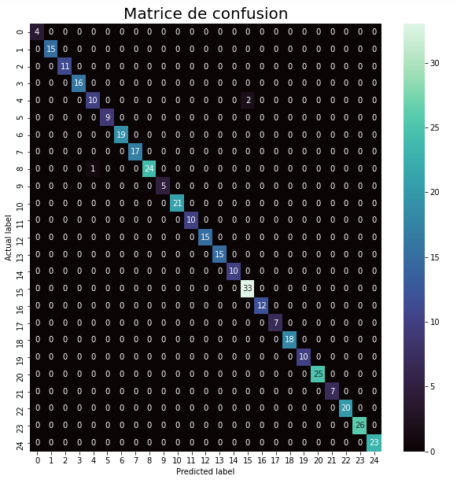

# CV_Classifier

## Contexte du projet :

Embaucher les bons talents est un défi pour toutes les entreprises. Ce défi est amplifié par le volume élevé de candidats si l'entreprise est bien réputée. Dans une organisation de services typique, des professionnels possédant une variété de compétences techniques et d'expertise sont embauchés et affectés à des projets pour résoudre les problèmes des clients.

Le projet consiste donc à utiliser des algorithmes d'apprentissage automatique afin de classifier des CV dans 25 classes différentes. Le dataset est composé d'un ensemble d'environ 900 CV labellisés, 20% d'entre eux nous servirons pour les tests. 

## Formation du modèle :

Pour la formation et l'entrainement du modèle nous utiliserons le modèle `Word2vec` du module `gensim` et `RandomForestClassifier`de `sklearn`. 

Dans un premier temps nouus prétraiterons nos données notamment grâce au module `BeautifulSoup` et `re` afin d'obtenir une liste de mots qui serviront pour l'apprentissage du modèle `Word2vec` afin de prédire le contexte de ceux-ci.

Puis, nous emploierons deux méthodes différentes en entrée du modèle `RandomForestClassifier` et comparerons les résultats afin de garder la méthode obtenant la plus grande précision : 

* Moyenne vectorielle 
* Sac de Centroïde

## Résultats :

Avec la méthode du `Sec de Centroïdes` nous obtenons une précision de **99,2** % sur les données de test. Voici la matrice de confusion :

### Le notebook est disponible [ici](CV_classifier.ipynb)

